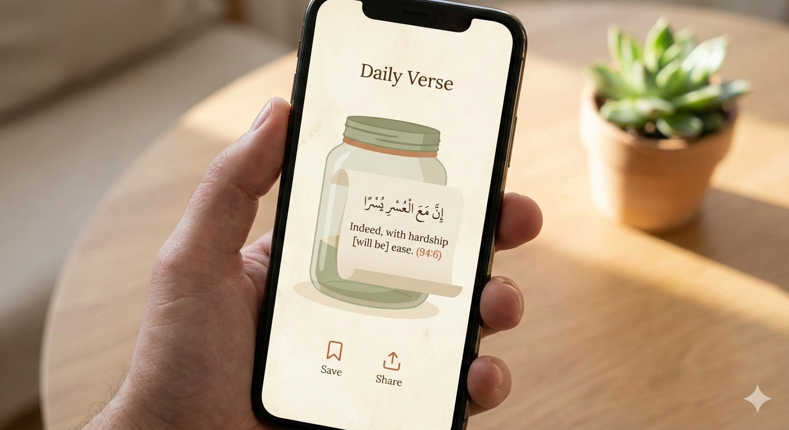

# Quran Jarr

<div align="center">
  
</div>

A beautiful and feature-rich Quran application built with Flutter.

## Features

- **Quran Reading** - Complete Quran with beautiful typography
- **Audio Playback** - Listen to Quran recitations with just_audio
- **Notifications** - Quran verse reminders with flutter_local_notifications
- **Image Sharing** - Share verses as images with friends and family
- **Offline Support** - Local storage with Hive for offline access
- **Smooth Animations** - Delightful user experience with flutter_animate
- **State Management** - Built with Riverpod for robust state handling

## Tech Stack

- **Framework**: Flutter 3.11+
- **State Management**: Riverpod
- **Networking**: Dio
- **Local Storage**: Hive
- **Audio**: just_audio
- **Notifications**: flutter_local_notifications
- **Code Generation**: freezed, json_serializable, build_runner

## Getting Started

### Prerequisites

- Flutter SDK 3.11.0 or higher
- Dart SDK compatible with Flutter 3.11+
- Android Studio / VS Code with Flutter extensions

### Installation

1. Clone the repository:
```bash
git clone https://github.com/your-username/quran-jarr.git
cd quran-jarr
```

2. Install dependencies:
```bash
flutter pub get
```

3. Run the app:
```bash
flutter run
```

### Building

For Android:
```bash
flutter build apk --release
```

For iOS:
```bash
flutter build ios --release
```

## Contributing

Contributions are welcome! Please feel free to submit a Pull Request.

## License

This project is licensed under the MIT License.

## Resources

- [Flutter Documentation](https://docs.flutter.dev/)
- [Riverpod Documentation](https://riverpod.dev/)
- [Flutter Learning Resources](https://docs.flutter.dev/reference/learning-resources)
